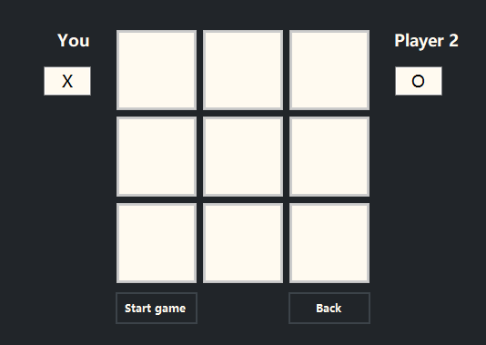
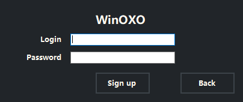
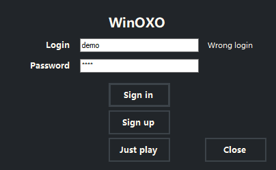
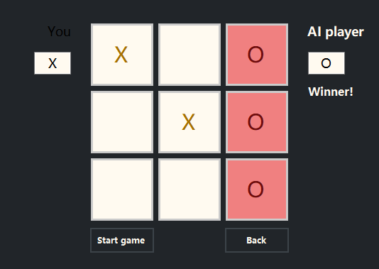
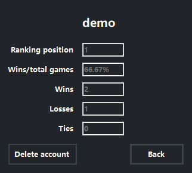

# **WinOxo**

"WinOxo" is an expanded version of the classic tic-tac-toe game, named after [one of the first video games](https://en.wikipedia.org/wiki/OXO_(video_game)) ever made. You can download a sideloading version of the app [here](https://www.dropbox.com/scl/fi/z9xwjgdabcb55u6rygidc/WinOxo.7z?rlkey=urt0fysfyyldwfss4c02obf8j&dl=0).

## **Technical side of things**

The application is written in C#, using WinForms and SQL Server for database management.

## **Features**

#### Player account

WinOxo offers two accessibility options: with or without a player account. To create an account you have to sign up, providing a unique username and a password.

When signing in, user data is validated against the database, granting access to the stored scores and the delete account option.

You can also opt for the "Just play" way that doesn't require an account.

#### Game mode

You can choose one of two game modes:

- single player (you versus an "AI" opponent)
- two players (you versus another player using the same device)

#### Symbol change

Before starting a new game you can choose what symbol you want to use. Just type in the character in the symbol box below your player name.

#### Player scores

If you sign up and create an account, you get access to the statistics regarding your previous games:

- your current position in the ranking of all registered players
- the percentage of games won
- number of games won
- number of games lost
- number of games tied

You can view them in the "Scores" window.

## **How to play?**

Sign in or choose the "Just play" option, then select the game mode (single player or two players) and click "Start game" to launch a new game. Active player name is displayed in white, while the inactive player name is grayed out. When the current round ends with one of the players being declared the winner or with a tie, you can start a new game or head to the scores window in order to browse your statistics.

## **Main challenges**

When designing and implementing the project I stumbled upon several challenges:

- _Tic-tac-toe algorithm_. I didn't know any "established" way to code in the algorithm to determine the outcome of a tic-tac-toe game, so I came up with my own solution. Upon each player's click on a game board field (1st field) the program iterates over all adjacent fields to see if there already exists another symbol belonging to the currently active player. If present, then it would proceed to this adjacent field (2nd field) and look for the symbol in the direction pointed to by the 1st field. E.g. if the 2nd field is to the top right from the 1st field, then the 3rd field checked would also be to the top right from the 2nd field. I also had to account for the case when there are 2 separate fields marked by the player and it clicks on the field between them, so I added a method to check if the currently chosen field is in-between two other fields with the same symbol and if they lie on the same line. 
- _"AI" opponent_. Apart from the conventional player vs. player game mode, I also wanted to provide an option to play against the machine. Therefore, I implemented an "AI" opponent that can handle this scenario. It doesn't use any true AI techniques, but just iterates over all empty fields on the game board and chooses one at random during each turn. It also waits a random amount of time between each choice to simulate the "decision making process". It's definitely not the hardest opponent, but it has managed to defeat me more than once.
- _Game-app communication_. I had to send signals between the game board and the rest of the app to dynamically account for changing the currently active player and highlight names or enable/disable buttons accordingly. To accomplish this I used the observer pattern, broadcasting events from the game board that other parts of the app are subscribed to, enabling them to respond on time.
- _Database connection_. I struggled with the database configuration and with the fact, that it wouldn't be accessible on devices lacking the appropriate software (SQL Server). To handle this scenario, I included a try-catch block that checks on launching the app if the connection to the database is possible. If so, then it displays the regular version of the program. Otherwise, only the "Just play" option (without the account) is accessible for the player.
- _Player ranking_. When displaying the scores I wanted to include the current position of the player among all other players registered (from the highest to the lowest score). To do that I needed to retrieve the data for all players in the database and sort it in decreasing order. Since at the time of designing the app I didn't know of the built-in sorting methods, I implemented my own, using the bubble sort algorithm.

## **Credits**

Created by Wojciech Grodzicki.